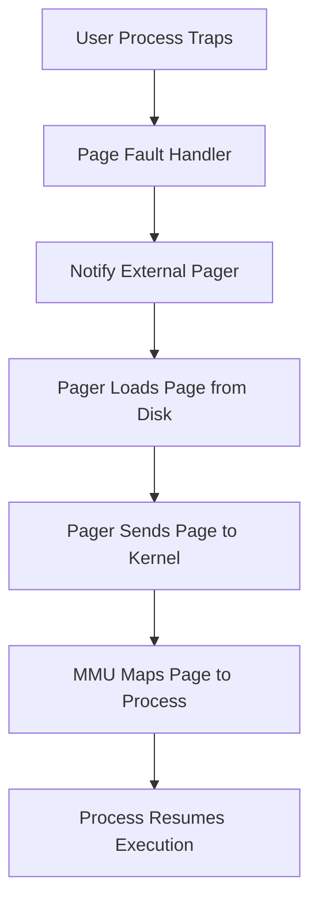

Here’s your styled, structured, and Obsidian-friendly summary of **Section 3.6 – Implementation Issues**:

---

## 🧪 3.6 Implementation Issues

> Designing a virtual memory system isn’t just about picking the right algorithm—it involves deep **OS-level decisions** and precise **hardware-software coordination**.

---

## ⚙️ 3.6.1 OS Involvement with Paging

---

### 🔄 When Does the OS Handle Paging?

1. **🧬 Process Creation**
   - Estimate memory needs
   - Create & initialize **page tables**
   - Allocate space in **swap area**
   - Initialize swap with **program text & data**
   - Save mapping info in **process table**

2. **⏯️ Process Execution**
   - **Reset MMU** for the process
   - **Flush TLB** (unless using **tagged TLBs**)
   - Load process’s page table or pointer into hardware
   - Optionally **prepage** certain pages (e.g., code near PC)

3. **💥 Page Fault**
   - Identify faulting address
   - Locate it on disk, find/free a page frame
   - Handle eviction (write out if dirty)
   - Load new page, update page table
   - Resume faulting instruction

4. **🛑 Process Termination**
   - Release page tables & memory pages
   - Clean up swap space
   - Keep shared pages only if **still in use**

---

## 💣 3.6.2 Page Fault Handling – Step-by-Step

---

### 🔁 Full Page Fault Lifecycle

1. **Trap** to kernel, save **PC**
2. Enter **interrupt service routine**, save volatile state
3. OS **determines faulting virtual page**
   - From registers or by **parsing the instruction**
4. Validate address & permissions
   - ❌ Invalid? → **Kill or signal process**
   - ✅ Valid? → Proceed
5. If no free frame:
   - Select victim via page replacement
   - If **dirty**, schedule write & **context switch**
6. Load required page from disk to frame
7. Update page table
8. **Reset PC** to faulting instruction
9. Reschedule process
10. Reload registers & resume execution

> ⏱️ Disk I/O can take milliseconds → process is suspended, others may run in the meantime.

---

## 🧭 3.6.3 Instruction Backup

---

### 😵 The Real-World Problem

Some instructions span **multiple memory addresses**:
```
MOV.L #6(A1), 2(A0)
```
- May touch 3 memory words:
  - Opcode
  - First operand (at 1002)
  - Second operand (at 1004)

If a fault occurs:
- PC might be at **1000**, **1002**, or **1004**
- OS must figure out:
  - Where did instruction begin?
  - Which **memory access** failed?

---

### 🔄 Autoincrement/Autodecrement

- Some CPUs **auto-modify registers** during instruction execution
- Side effects might:
  - **Have happened** (need to undo)
  - **Not yet happened** (must not undo)

> Behavior varies across **instruction type** and **CPU model**—a nightmare for OS designers!

---

### ✅ Hardware Support (if available)

Some CPUs provide:
- **Internal backup PC register**
- **Side effect tracker** (register autoincrements/decrements)

> Allows **precise restoration** of instruction state  
> If absent: OS must use **complex heuristics**

---
Here’s the styled, structured, Obsidian-friendly summary for **Section 3.6.4 – 3.6.6: Paging Implementation Issues**:

---
## 🔒 3.6.4 Locking Pages in Memory

---

### 📦 The I/O & Paging Interaction Problem

- Process issues an **I/O request** to write to a buffer in its **virtual address space**
- OS **suspends** it; another process runs and causes a page fault
- If the **I/O buffer page** is selected for eviction during I/O → ❌ data corruption

### 🛡️ Solutions

1. **Pin (lock) the page in memory**
   - Prevents eviction during DMA

2. **Double buffering**
   - Use **kernel buffers** for I/O, then copy to user space  
   - ❌ Adds extra copy → **slower**

---

## 💾 3.6.5 Backing Store

---

### 🧱 Static Swap Partition

- Allocate a dedicated **swap partition** (or device)
- UNIX-style: no file system overhead; addresses are block-relative
- Each process gets a **chunk of swap** = size of its image

> 📌 Easy to calculate where a page goes:  
`Disk address = start of swap + page offset`

---

### 🔄 Dynamic Paging to Disk

- Pages are **assigned disk space on demand**
- Deallocate when pages are loaded back into memory
- Requires a **per-process disk map** for virtual-page → disk-page tracking

#### 🧭 Two Models:

| Model | Description |
|-------|-------------|
| **(a) Static Swap Area** | Fixed page-to-disk mapping |
| **(b) Dynamic Allocation** | Disk space is reused; tracking needed |

---

### 🗂️ No Swap Partition?

- Use large **preallocated files** in the file system
- Common in **Windows**
- Optimization:
  - **Read-only text** pages (like program code) can be discarded  
  - Reload from **executable** or **shared library file** as needed

---

## ⚖️ 3.6.6 Separation of Policy and Mechanism

---

### 🧱 Principle: Modularity through Separation

> **Policy** = *What* to do (e.g., which page to evict)  
> **Mechanism** = *How* to do it (e.g., MMU operation)

---

### 🧩 Mach-Style Architecture

#### 🔄 3-Tier Paging Stack

1. **MMU Handler** (machine-dependent)
   - Low-level, talks to hardware

2. **Page Fault Handler** (kernel)
   - Machine-independent; handles page faults

3. **External Pager** (user space)
   - Determines **policy** (e.g., replacement algorithm)

---

### 📥 Page Fault Handling Flow



---

### ❗ Challenges

- External pager lacks access to **R (Referenced)** and **M (Modified)** bits
  - These are needed for many algorithms (e.g., NRU, WSClock)
- Either:
  - Pass R/M info to pager
  - Or **move page replacement policy into the kernel**

---

### ✅ Advantages

- 🔄 **Flexible, modular** design
- 🛠️ Easier to **swap and test algorithms**
- 🔐 Separation promotes **clean architecture**

---

### ❌ Drawbacks

- ⚙️ More **user-kernel context switches**
- 📬 Increased **message overhead**
- ❗ Slower but more maintainable

---

Let me know when you're ready for Section 3.7 or want a cheat sheet for the entire Chapter 3.6!