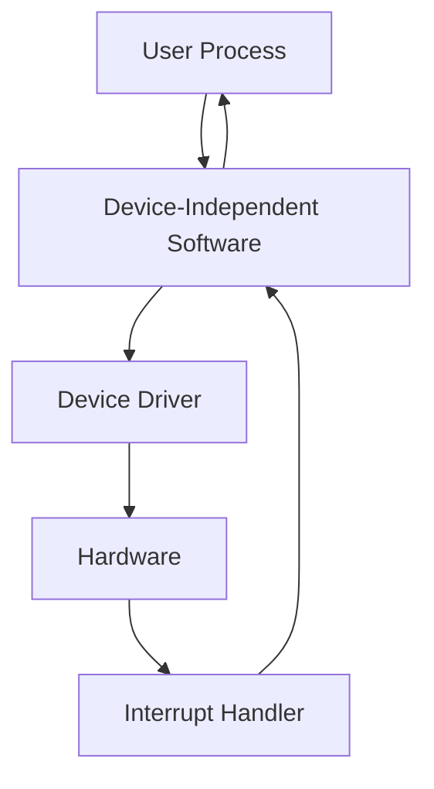

### 📚 Overview
I/O software is typically structured into **four layers**:

![[{210DC53B-78CA-419E-8793-4CB227F7D3B6}.png]]
Each layer has a specific, modular function and well-defined interfaces with adjacent layers. Let’s begin with the **lowest layer**: **Interrupt Handlers**.

---

## ⚡ 5.3.1 Interrupt Handlers

### 📌 Role
- Designed to **handle device interrupts**.
- **Hide hardware complexity** from the rest of the OS.
- **Minimize exposure** of interrupts to other OS components.

### 🔁 Workflow Model
- Driver starts I/O operation and **blocks itself** (e.g., via:
  - `semaphore.down()`
  - `condition_variable.wait()`
  - `message.receive()`)
- Interrupt occurs when device completes work.
- Interrupt Handler:
  - Processes the interrupt.
  - **Unblocks** the waiting driver (e.g., via:
    - `semaphore.up()`
    - `condition_variable.signal()`
    - `message.send()`)

This is cleanest when **drivers are structured as independent processes**, each with its own **state, stack, and PC**.

---

### 🧩 Real-World Complexity

Interrupt handling involves multiple software steps beyond just a simple unblock:

#### 🔟 Typical Interrupt Handling Steps:

1. **Save registers** not already saved by hardware (including PSW).
2. **Set up interrupt context**:
   - May involve setting up MMU, TLB, and page table.
3. **Initialize stack** for the ISR.
4. **Acknowledge** the interrupt controller (or re-enable interrupts if no controller exists).
5. **Copy saved registers** to the **process table**.
6. **Run the ISR (interrupt-service routine)**:
   - Typically reads status from device controller registers.
7. **Schedule the next process**:
   - Possibly a higher-priority process that was blocked.
8. **Set MMU context** for selected process (possibly including TLB setup).
9. **Load new process’ registers**, including PSW.
10. **Resume execution** of the selected process.

---

### ⚠️ Performance Considerations
- Complex on systems with **virtual memory**:
  - MMU state (e.g., R and M bits) must be managed.
  - TLB and caches may need flushing during mode switch.
- Interrupt processing is **non-trivial** and consumes **significant CPU cycles**.

---
## 🧩 5.3.2 Device Drivers

### 🎯 Purpose
Device drivers are **device-specific software components** that manage communication between the OS and I/O devices. They:
- Handle hardware register commands.
- Translate abstract OS-level operations into **device-level control sequences**.

Each I/O device requires its own **driver** (or one from the same device class). Device drivers are usually:
- Supplied by the manufacturer.
- Written separately for different OS platforms.

---

### 📚 Examples
- 🖱️ **Mouse driver**: Tracks movement, button states.
- 💽 **Disk driver**: Manages sectors, tracks, seek operations, etc.
- 🔌 **USB stack**: Shared layers for USB signaling + device-specific layers (e.g. USB camera, disk).

---

### 🧱 Kernel vs User Space Drivers
- **Kernel-mode drivers**: Most common (due to access needs).
- **User-space drivers**: Safer and more robust (e.g. MINIX 3), use system calls to access hardware.

> 🔐 *User-space drivers can isolate faults and improve reliability by preventing interference with the kernel.*

---

### 🧰 OS Support for Drivers
- OS must define:
  - **Driver interface contracts**.
  - **Driver categories**: 
    - **Block devices**: (e.g., disks, SSDs) — addressable data blocks.
    - **Character devices**: (e.g., keyboard, printers) — streams of characters.
- OS typically provides:
  - A **standard interface** for each device type.
  - **Dynamic driver loading** (common in modern OSes like Linux/Windows).
  - Legacy OSes like early UNIX had **drivers compiled directly into the kernel**.

---

### ⚙️ Typical Driver Structure

#### Main Responsibilities
- Accept abstract operations (e.g. "write block").
- Initialize the device.
- Manage power usage or event logging.

#### Standard Execution Flow:
```text
1. Validate input parameters.
2. Translate abstract commands (e.g., block # → cylinder/head).
3. Check if device is busy; queue if needed.
4. If idle → prepare device (e.g. spin disk, initialize print head).
5. Issue command sequence via hardware registers.
6. Wait for operation to complete (may block or proceed).
7. On completion:
   a. Check for errors.
   b. Return results/status to upper layers.
   c. Process queued operations.
```

> 🧵 Some controllers can process a **linked list of commands** autonomously.

---

### 🚨 Real-World Complications

#### ❗ Reentrancy
- **Drivers must be reentrant**: They may be interrupted and re-entered while already running.

#### 🔌 Hot-Plugging
- Device may be:
  - **Removed**: Must abort active/pending I/O, clean up queues, notify users.
  - **Inserted**: May require dynamic reallocation of kernel resources (e.g., IRQ lines).

#### 🚫 System Call Restrictions
- Drivers **cannot make system calls**.
- Can invoke special **kernel-level functions** for:
  - Memory allocation (e.g., for buffers).
  - MMU, timer, DMA, interrupt controller configuration.

---

### 📌 Summary of Device Driver Characteristics
| Feature                   | Description |
|---------------------------|-------------|
| **Type**                  | Block or Character |
| **Interface**             | OS-defined procedures (e.g., read, write) |
| **Execution Context**     | Typically kernel space |
| **Driver Behavior**       | Validate → Translate → Queue/Execute → Monitor → Return |
| **Safety Features**       | Reentrant, hot-plug aware, restricted kernel APIs |

---
## 🧩 5.3.3 Device-Independent I/O Software

### 🎯 Purpose
Device-independent I/O software provides a **uniform interface** across diverse I/O devices. Its goal is to:
- Abstract away hardware-specific details from higher software layers.
- Centralize and standardize functions common across devices.

---

### 🔧 Key Responsibilities
Outlined in Fig. 5-13, the device-independent layer typically handles:

- ✅ **Uniform interfacing for device drivers**
- 🔁 **Buffering**
- ❗ **Error reporting**
- 🔒 **Allocation/release of dedicated devices**
- 📦 **Providing device-independent block sizes**

---

### 📐 Uniform Interfacing for Drivers

#### 🔄 The Problem
Without standardization:
- Every driver has a unique interface → increases integration effort.
- Kernel-side function calls differ across drivers → harder maintenance.
  
**Fig. 5-14(a)** shows this fragmented model.

#### ✅ The Solution
With standard interfaces:
- All drivers in a **device class (e.g., disks, printers)** implement the same function set.
- Operating system only needs to know a **common function table** (pointers to driver's functions).
  
**Fig. 5-14(b)** shows a clean, modular model:
```c
// Driver's function table example
disk_driver = {
  .read = &disk_read,
  .write = &disk_write,
  .format = &disk_format,
  ...
}
```

The OS invokes functions via indirect calls using these tables.

---

### 📛 Naming Devices

- Device-independent layer handles **mapping symbolic names to physical devices**.
- In **UNIX**, devices appear in the file system under paths like `/dev/disk0`.

Each device is associated with:
- **Major number** → identifies the driver.
- **Minor number** → identifies the specific unit (e.g., disk 0, disk 1).

#### Example:
```bash
/dev/disk0
# inode contains:
# - major: points to disk driver
# - minor: specifies device instance
```

---

### 🔐 Device Protection

- **Devices are treated like files** in both UNIX and Windows.
- File system permissions (read, write, execute) control access to devices.
- System administrator sets access rights for devices like `/dev/tty`, `/dev/lp0`, etc.

---

### 🧩 Summary Table

| Function                            | Description |
|-------------------------------------|-------------|
| Uniform driver interface            | Standard function set per device class |
| Symbolic name mapping               | Maps device names to drivers (via i-nodes in UNIX) |
| Buffering support                   | Temporarily holds I/O data for timing/speed mismatch |
| Error handling                      | Manages transient or fatal I/O faults |
| Device access control               | Enforces protection rules via file-system permissions |
| Device-independent block sizing     | Provides abstraction for various native block sizes |

---
## 🧃 Buffering (for both Input and Output)

Buffering is crucial in I/O to improve performance and handle device timing issues.

### 🔄 Input Buffering Strategies (based on Fig. 5-15)

| Diagram | Strategy | Description |
|--------|----------|-------------|
| (a) | **No Buffering** | Process blocks for each char → very inefficient |
| (b) | **User-Space Buffering** | Interrupt handler fills a buffer in user space; wakeup on full buffer. Problem if buffer is paged out. |
| (c) | **Kernel Buffering** | Interrupt handler stores in kernel → one copy to user space when full |
| (d) | **Double Buffering** | Two kernel buffers alternate: one being copied to user space, the other filling with data |

---

### 🔄 Circular Buffering
- A ring of memory with two pointers:
  - One for adding new data (producer)
  - One for reading out processed data (consumer)
- Wraps around when end is reached
- Used for streaming data like network or sensor input

---

### 🔁 Output Buffering Example (Modem)
- Without buffering:
  - Either blocks user until done (slow), or allows reuse prematurely (race conditions)
- With buffering:
  - Kernel copies data to internal buffer and unblocks user immediately
  - Actual I/O happens later in background

---

### ❗ Buffering Trade-offs
- Reduces interrupt overhead and improves throughput
- **Too much buffering = performance loss** due to excessive memory copies

#### 📦 Networking Example (Fig. 5-16)
1. User data → kernel buffer
2. Kernel buffer → network controller
3. Controller → network
4. Receiver's controller → kernel
5. Kernel → receiver’s user process

→ **Multiple copies slow down transmission**

---

## ❗ Error Reporting

### Types of I/O Errors

| Type | Description | Handling |
|------|-------------|----------|
| **Programming Errors** | e.g., writing to a keyboard | Return error code to process |
| **Device Errors** | e.g., read failure due to disk damage or unplugged device | Driver tries to recover or escalates to higher layers |
| **Critical Failures** | e.g., damaged root directory or free block list | May require system termination |

### 🚫 Example Recovery Options
- Retry read
- Ignore error
- Kill process (interactive context)
- Display user dialog (interactive)
- Return error (non-interactive)

---

## 🖨️ Allocating and Releasing Dedicated Devices

Some devices (e.g. printers, scanners) are **non-shareable**:
- **open() fails** if in use (simple method)
- **Advanced method**: Block the request and queue it
  - Once released, next in queue proceeds
  - Prevents starvation and race conditions

---

## 🧱 Device-Independent Block Size

- **Abstract block size is standardized**, regardless of physical sector/page size
  - e.g., flash page size ≠ disk sector size
  - Device-independent software hides these differences

- Also applies to character devices:
  - Mice → 1 byte at a time
  - Ethernet cards → Packets
  - Software layer normalizes handling

---

### 🧩 Summary Table

| Concept | Function |
|--------|----------|
| Input buffering | Smoothes data flow, handles slow processes |
| Output buffering | Prevents blocking, improves efficiency |
| Circular buffers | Non-blocking streaming, avoids data loss |
| Error handling | Reports and recovers from both hardware & software errors |
| Dedicated devices | Allocates device per process, enforces exclusivity |
| Logical block size | Hides hardware-specific details from higher OS layers |

---
## 👨‍💻 5.3.4 User-Space I/O Software

### 📦 Role of User-Space I/O

Although most I/O logic resides in the kernel, some operations are handled in **user-space** via:
- **Linked library procedures**
- **User-level daemons**
- **Spooling systems**

---

### 🧱 Library-Based I/O

- System calls like `write(fd, buffer, nbytes)` are **invoked via standard library functions**
- These may be:
  - Statically linked during compile time
  - Dynamically linked at runtime

#### 🔧 Functions of Library Procedures
- Basic system call wrappers (e.g. `write`, `read`)
- **Formatted I/O** using:
  - `printf`: formats variables into a string, then calls `write`
    - e.g., `printf("The square of %3d is %6d\n", i, i*i);`
  - `scanf`: parses formatted input
- Act as **pre/post-processing layers** before invoking kernel-level I/O

---

### 🖨️ Spooling: Handling Dedicated Devices in Multiprogramming

Spooling (Simultaneous Peripheral Operation On-Line) decouples user access from direct device use.

#### Example: Printing System
1. User process creates the full file to print
2. File is stored in a **spooling directory**
3. A **daemon** process (e.g., `lpd`) handles the actual printing
4. Only the daemon can access the printer’s special file

✅ Prevents scenarios like:
- A user process holding the printer idle for hours

---

### 🔄 I/O Flow Summary



---

### 🪜 Layers of the I/O System (Fig. 5-17)

| Layer | Functions |
|-------|-----------|
| **User Processes** | I/O calls (`read`, `write`), formatting (e.g., `printf`), spooling |
| **Device-Independent Software** | Naming, buffering, blocking, permissions, allocation |
| **Device Drivers** | Register setup, I/O command logic |
| **Interrupt Handlers** | Respond to device completion and notify drivers |
| **Hardware** | Actual I/O execution |

---

### 🧠 Final Control Flow Summary

- User requests I/O (e.g., disk read)
- OS checks **buffer cache**
- If needed → invokes **device driver**
- Driver sends command to **hardware**
- Hardware performs I/O → raises **interrupt**
- **Interrupt handler** processes completion
- OS **wakes up the user process**
- Process resumes with data ready

---
